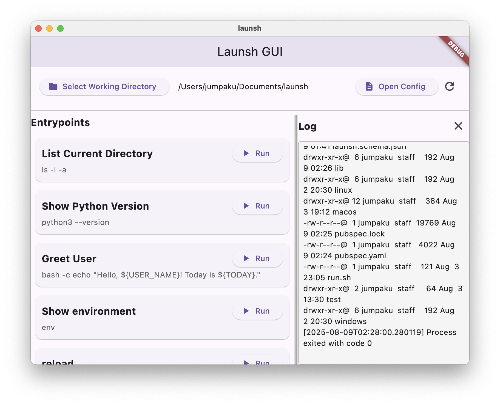
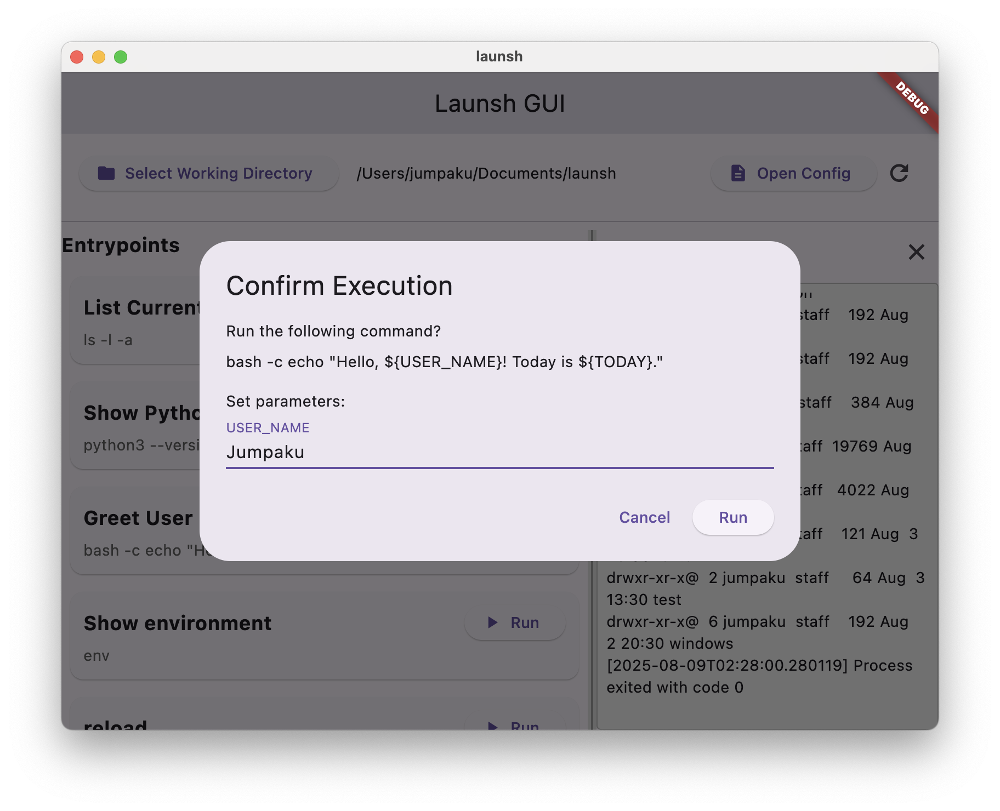

# launsh

`launsh` is a cross-platform script launcher with a graphical user interface, configured via a single JSON file.
It helps you organize and run your frequently used shell commands and scripts with a single click.




```json
{
  "$schema": "./launsh.schema.json",
  "entrypoints": {
    "List Current Directory": {
      "description": "Lists files and directories in the current path.",
      "program": "ls",
      "args": [
        "-l",
        "-a"
      ]
    },
    "Greet User": {
      "description": "A sample command that uses environment variables and arguments with parameters.",
      "program": "bash",
      "args": [
        "-c",
        "echo \"Hello, ${USER_NAME}! Today is ${TODAY}.\""
      ],
      "parameter": [
        "USER_NAME"
      ],
      "environment": {
        "TODAY": "Monday"
      },
      "stdout": "stdout.log",
      "stderr": "stderr.log"
    },
    "Run script": {
      "description": "A sample command that uses environment parameters and arguments with parameters.",
      "program": "sh",
      "args": ["./run.sh"]
    }
  }
}
```